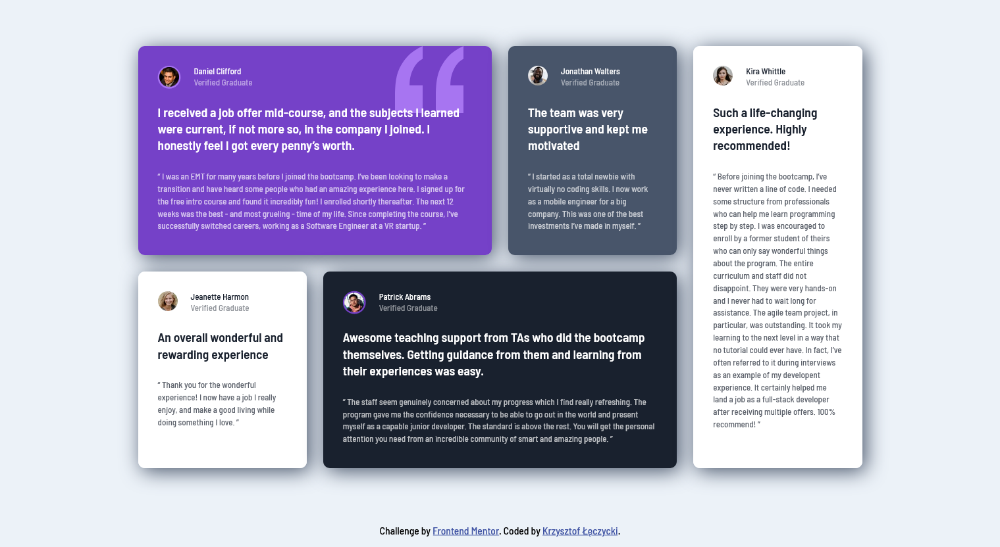

# Frontend Mentor - Testimonials grid section solution

This is a solution to the [Testimonials grid section challenge on Frontend Mentor](https://www.frontendmentor.io/challenges/testimonials-grid-section-Nnw6J7Un7). Frontend Mentor challenges help you improve your coding skills by building realistic projects. 

## Table of contents

- [Overview](#overview)
  - [The challenge](#the-challenge)
  - [Screenshot](#screenshot)
  - [Links](#links)
- [My process](#my-process)
  - [Built with](#built-with)
  - [What I learned](#what-i-learned)
  - [Continued development](#continued-development)
  - [Useful resources](#useful-resources)
- [Author](#author)

## Overview

### The challenge

Users should be able to:

- View the optimal layout for the site depending on their device's screen size

### Screenshot



### Links

- Solution URL: [Add solution URL here](https://github.com/KrzysztofLeczycki/testimonials-grid-section)
- Live Site URL: [Add live site URL here](https://krzysztofleczycki.github.io/testimonials-grid-section/)

## My process

### Built with

- Semantic HTML5 markup
- SCSS
- Flexbox
- CSS Grid
- Mobile-first workflow

### What I learned

My goal in doing this project was to play around with the CSS grid layout.
I focused on the responsiveness of the grid and limiting usage of the media queries. The `minmax()` function and `auto-fit` property were helpful to minimise the amount of code.

```css
.grid {
  grid-template-columns: repeat(auto-fit, minmax(250px, 1fr));
}
```

### Continued development

My short time goal is to improve my fluency in writing JS scripts, use more advanced concepts like AJAX and third parties API and learn React. 

### Useful resources

- [Kevin Powell's YT channel](https://www.youtube.com/watch?v=sKFW3wek21Q) - The responsive grid concept is explained in the clear way.
## Author

- Website - [Krzysztof Łęczycki](https://krzysztofleczycki.github.io/portfolio/)
- Frontend Mentor - [@KrzysztofLeczycki](https://www.frontendmentor.io/profile/KrzysztofLeczycki)
